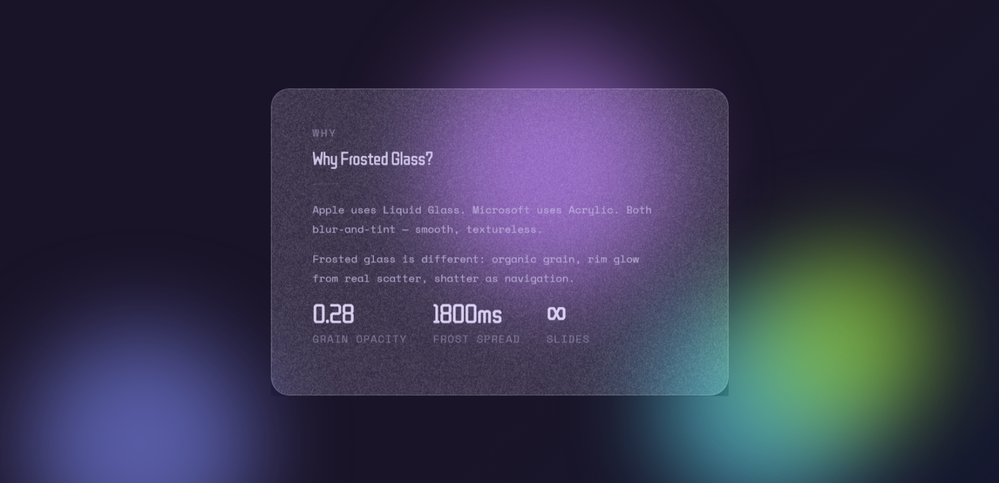

# ❄ FrostPPT

> Frosted-Glass HTML Presentations — Generated from Python

FrostPPT is a Python-powered presentation engine that generates stunning,
animated, frosted-glass HTML slide decks.

No PowerPoint.  
No Keynote.  
Just Python → Beautiful Slides.

---


---

# ✨ Live Demo

Open:

    FrostPPT Demo.html

This file is a fully exported, self-contained FrostPPT presentation.
No dependencies required. Just double-click and present.

---

# 🎥 Visual Preview

> Place exported screenshots and GIF recordings from FrostPPT Demo.html
> inside an `/assets` folder in your repository.

## ❄ Frost Crystallising Animation


## 🌈 Animated Gradient Background & Orbs


## 🧊 Frosted Glass Card


## 💡 Mouse-Reactive Border Glow


---

# 🚀 Features

## ❄ Frosted Glass Engine
- Crystallising frost spread animation
- Grain-textured glass surface
- Dynamic glass glow reacting to mouse movement
- Material-inspired depth and blur

## 🎨 Visual Customisation
- 53 animated gradient presets
- 54 drifting orb colour presets
- 55 curated Google Font pairings
- Automatic text contrast detection
- Custom heading & body fonts

## 📑 Slide Types
- Title
- Content
- Two Column
- Quote
- Media (image / video / audio)
- Raw HTML

## 🧠 Smart System
- `.frppt` JSON project format
- Autosave recovery
- Decompile exported HTML back to editable source
- Fully offline exported presentations

---

# 📦 Installation

## From PyPI

    pip install frostppt

## Local Usage

Download:

    frostppt.py
    frostppt_cli.py

---

# ⚡ Quick Start

## CLI Mode

    python frostppt_cli.py

Follow prompts.

Output:

    my_deck.html
    my_deck.frppt

Open the HTML file to present.

---

## Python API Example

```python
from frostppt import Presentation, Slide

prs = Presentation(title="My FrostPPT Deck")

prs.add(Slide.title(
    heading="Where Ideas Crystallise",
    tagline="A Python-powered presentation engine",
    pills=["HTML", "Open Source", "Frosted Glass"]
))

prs.add(Slide.content(
    heading="Why FrostPPT?",
    body=[
        "No PowerPoint required.",
        "Fully offline HTML export.",
        "Beautiful by default."
    ]
))

prs.save("my_deck.html")
```

---

# 📁 Project Structure

    frostppt.py
    frostppt_cli.py
    FrostPPT Demo.html
    README.md
    LICENSE

---

# 🎯 Why FrostPPT?

Most presentation tools focus on templates.

FrostPPT focuses on:
- Atmosphere
- Motion
- Material depth
- Aesthetic consistency

It is not just slide generation.
It is a visual engine.

---

# 📜 License

Mozilla Public License 2.0 (MPL-2.0)

You may:
- Use commercially
- Modify
- Redistribute

You must:
- Preserve author credit
- Keep modifications to FrostPPT files open source under MPL-2.0

See LICENSE for details.

---

# 👤 Author

D. Saahishnu Ram

Where ideas crystallise.
